# DepositGuard

<p align="center">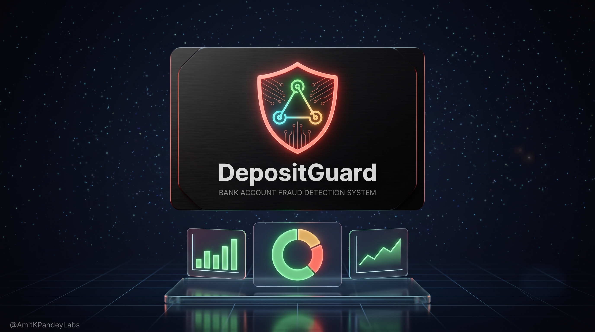</p>

<p align="center">
  <a href="https://depositguard.streamlit.app/" target="_blank" rel="noopener noreferrer">
    
  </a>
</p>

<p align="left">
  
  
  
  
  
  
</p>

DepositGuard is an end-to-end deposit account fraud detection system: it engineers behavioral risk features from account-opening data, benchmarks four classifiers under realistic class imbalance, explains individual risk scores with SHAP, and routes high-risk accounts through a multi-agent LangGraph pipeline that grounds its reasoning in real regulatory text before handing off to a deterministic, auditable escalation decision — all surfaced through a live Streamlit dashboard.

## Table of Contents

- [Project Overview & Business Problem](#project-overview--business-problem)
- [Dataset](#dataset)
- [Methodology](#methodology)
  - [1. Feature Engineering](#1-feature-engineering)
  - [2. Exploratory Data Analysis](#2-exploratory-data-analysis)
  - [3. Predictive Modeling](#3-predictive-modeling)
- [Results & Key Findings](#results--key-findings)
- [Fraud Investigation Pipeline (Final System)](#fraud-investigation-pipeline-final-system)
- [Streamlit Dashboard](#streamlit-dashboard)
- [Conclusion](#conclusion)
- [Future Enhancements](#future-enhancements)
- [Tools & Technologies Used](#tools--technologies-used)
- [How to Run This Project](#how-to-run-this-project)
- [License](#license)

## Project Overview & Business Problem

Deposit account fraud — new account fraud, ACH fraud, mule accounts, check fraud — costs U.S. banks billions of dollars annually. Most institutions still lean on legacy, rules-based detection: static SQL/Oracle trigger logic that fires on known patterns but misses novel combinations of behavioral signals, backed by manual analyst investigation against dense regulatory text (Reg E, NACHA, BSA/AML). That combination is slow, inconsistent across analysts, and hard to audit at scale.

This project targets six concrete goals:

1. **Engineer real behavioral fraud-detection features** from raw account-opening data rather than relying on the dataset's original fields alone.
2. **Benchmark ML models under realistic class imbalance** (fraud is ~1.1% of applications) using a temporal validation split and SMOTE, not a random shuffle that leaks the future into training.
3. **Produce an explainable, production-style risk scorer** — every prediction is decomposed into its top SHAP-driving features, not just a bare probability.
4. **Build a multi-agent investigation layer that grounds its reasoning in actual regulatory text via RAG**, rather than asking a generic LLM to freelance an opinion about fraud regulation.
5. **Keep the actual account-action decision fully deterministic and auditable** — the LLM investigates and explains, but a fixed, inspectable rule set decides FREEZE / ESCALATE / MONITOR / CLEAR.
6. **Ship this as a live, explorable analytics dashboard** rather than a static notebook, so model performance, feature attributions, and individual case investigations can all be inspected interactively.

Where this differs from what most banks run today: DepositGuard replaces static rule triggers with ML-driven behavioral scoring, and replaces (or augments) generic LLM summarization with an investigation layer whose reasoning is grounded in retrieved regulatory text rather than the model's parametric memory. Critically, the LLM never decides the outcome — a deterministic rule gate does, so every escalation decision reduces to an inspectable `if` condition rather than an opaque model output.

## Dataset

DepositGuard is built on the [Bank Account Fraud (NeurIPS 2022) dataset](https://www.kaggle.com/datasets/sgpjesus/bank-account-fraud-dataset-neurips-2022) (the `Base` variant), published by Feedzai researchers as a privacy-preserving, synthetically generated but realistically-distributed suite modeling real-world deposit account opening fraud. It contains 1,000,000 applications across 32 features spanning applicant identity signals (name/email similarity, phone validity), financial signals (income, credit risk score, proposed credit limit), device/session signals (device OS, session behavior), and application velocity (`velocity_6h`, `velocity_24h`, `zip_count_4w`).

**Class breakdown:** 11,029 fraud (**1.103%**) vs. 988,971 legitimate (**98.897%**) — a ~1:90 imbalance ratio.

This dataset was chosen over alternatives like PaySim because PaySim simulates post-account *transactions* (transfers, cash-outs) on a mobile money network, with no application-time features at all. DepositGuard's problem is account-*opening* fraud — the applicant-level identity, employment, device, and credit signals available the moment an account is created — which is exactly what the Bank Account Fraud dataset provides and PaySim does not.

## Methodology

### 1. Feature Engineering

Ten behavioral risk features are engineered on top of the raw dataset (`notebooks/02_feature_engineering.ipynb`) before any modeling happens:

| Feature | Formula | Fraud Signal Rationale |
|---|---|---|
| `income_ratio` | `proposed_credit_limit / (income + 1)` | A large credit ask relative to reported income is a classic over-reach signal in fraudulent applications. |
| `address_stability` | `prev_address_months_count + current_address_months_count` (sentinel `-1` → 0) | A short, unstable address history is a common marker of synthetic or fabricated identities. |
| `identity_score` | `name_email_similarity*0.4 + phone_home_valid*0.3 + phone_mobile_valid*0.3` | A weighted composite of identity-verification checks; lower scores mean weaker identity confidence. |
| `credit_income_ratio` | `proposed_credit_limit / (income*12 + 1)` | Proxy for credit-limit aggressiveness relative to annualized income (no `annual_inc` field exists, so `income` substitutes per the fallback rule). |
| `rapid_application` | `1` if `days_since_request < 1` else `0` | Applications submitted almost immediately after the triggering event are associated with automated or opportunistic fraud attempts. |
| `employment_risk` | Ordinal rank of `employment_status` by historical fraud rate (0 = lowest, n-1 = highest) | Anonymized category codes have no inherent order, so the order is learned empirically from observed fraud rates. |
| `email_risk` | `email_is_free` cast to int | Free email providers are cheap to create in bulk — a known low-cost signal for synthetic identities and fraud rings. |
| `age_income_peer_deviation` | `(income - age_group_mean) / age_group_std`, grouped by `customer_age` | A z-score of how far an applicant's income sits from same-age peers; large deviations in either direction suggest an anomalous or fabricated profile. |
| `credit_tier` | `pd.cut(credit_risk_score, bins=5)`, encoded 0–4 | Buckets a continuous risk score into coarse tiers, giving tree-based models cleaner split candidates. |
| `fraud_risk_index` | Mean of min-max-normalized `rapid_application`, `employment_risk`, `email_risk`, `credit_tier`, `\|age_income_peer_deviation\|` | An equal-weighted composite of five primary risk signals, each normalized to [0, 1] so no single signal's raw scale dominates. |

### 2. Exploratory Data Analysis

**Fraud rate by month** — fraud rate climbs from a low of 0.87% (month 2) to a high of 1.47% (month 7) across the dataset's 8-month span, indicating real temporal drift rather than a stationary fraud rate. This is why the modeling stage uses a temporal split (train on months 0–5, test on 6–7) instead of a random shuffle — a random split would let the model implicitly "see" the harder, higher-fraud-rate future during training.

<p align="center">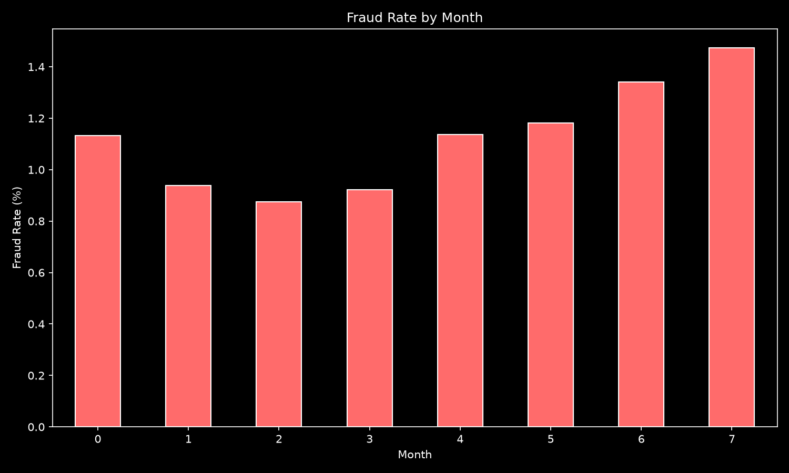</p>

**Feature distributions by fraud status** — `income`, `customer_age`, and `credit_risk_score` split by `fraud_bool` show visibly shifted distributions for fraudulent applications, most notably in `credit_risk_score`, which also emerges as the single strongest linear correlate of fraud (r = 0.071) among the original numeric features.

<p align="center">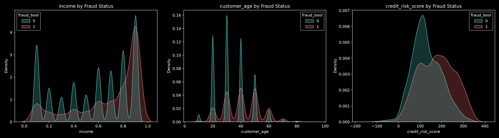</p>

**Correlation heatmap** — no single original feature strongly predicts fraud in isolation (correlations with `fraud_bool` are all comparatively weak), which is the core motivation for engineering composite behavioral features rather than relying on raw fields alone.

<p align="center">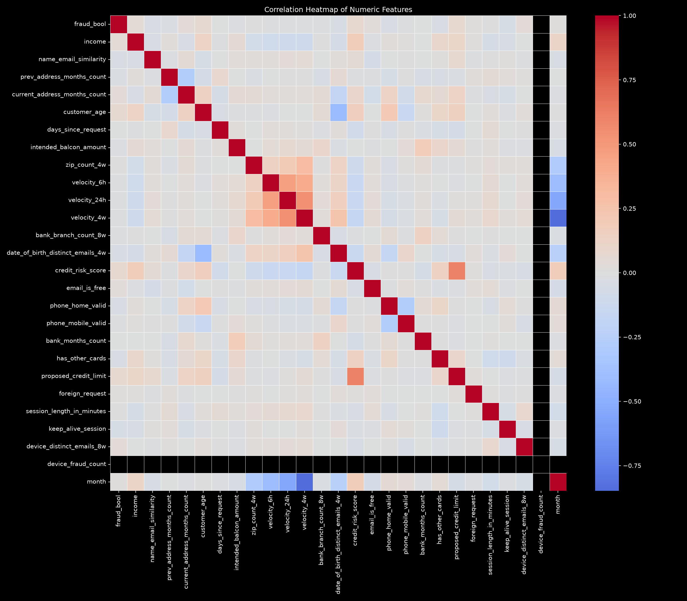</p>

**Fraud rate by category** — `payment_type` category `AC` has the highest fraud rate (1.67%) among payment types, and `employment_status` category `CC` has the highest fraud rate (2.47%) among employment categories, both well above their peers — confirming categorical fields carry real signal despite being anonymized.

<p align="center">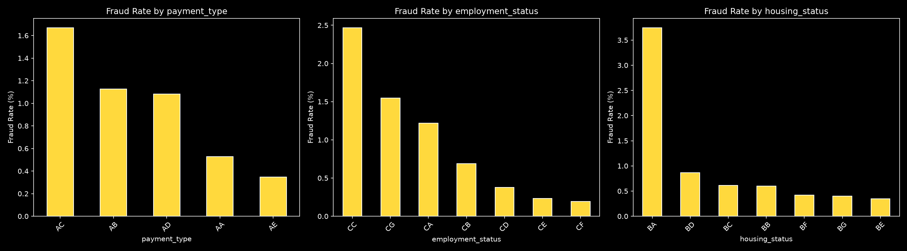</p>

### 3. Predictive Modeling

Four classifiers are trained on the feature-engineered dataset (`notebooks/03_model_benchmarking.ipynb`) using a **temporal validation split** (train on months 0–5, test on months 6–7) and **SMOTE** oversampling (`sampling_strategy=0.1`) applied to the training data only, so the untouched test set still reflects the real ~1% fraud rate:

- **Logistic Regression** — a fast, linear, fully interpretable baseline (with `StandardScaler`-normalized inputs, since it's the only one of the four models that isn't scale-invariant). Establishes the floor every other model needs to beat.
- **Decision Tree** — a single interpretable tree that captures simple nonlinear threshold rules and feature interactions the linear baseline can't, without requiring feature scaling.
- **AdaBoost** — an ensemble of weak learners that iteratively reweights misclassified examples, typically improving recall on the rare class over a single tree at some cost to precision.
- **XGBoost** — gradient-boosted trees with native class-imbalance handling via `scale_pos_weight`, L1/L2 regularization, and a strong track record on tabular fraud-detection benchmarks; the expected top performer and the model that ultimately powers the risk scorer.

## Results & Key Findings

| Model | AUC-ROC | Precision | Recall | F1 | FPR |
|---|---|---|---|---|---|
| Logistic Regression | 0.8258 | 0.1048 | 0.3846 | 0.1647 | 0.0468 |
| Decision Tree | 0.7707 | 0.0653 | 0.3325 | 0.1092 | 0.0677 |
| AdaBoost | 0.8570 | 0.4232 | 0.0431 | 0.0782 | 0.0008 |
| **XGBoost** | **0.8892** | **0.1984** | **0.3509** | **0.2535** | **0.0202** |

**Key Finding:** XGBoost wins on AUC-ROC (0.8892) — the standard threshold-independent metric for imbalanced binary classification, since it measures ranking quality rather than performance at one arbitrary cutoff. This matters here because the compounded SMOTE + class-weighting setup pushes all four models toward high recall / lower precision at the default 0.5 threshold; a deployment would still need the winning model's threshold tuned against a business-defined cost trade-off between missed fraud and blocked legitimate customers.

<p align="center">
  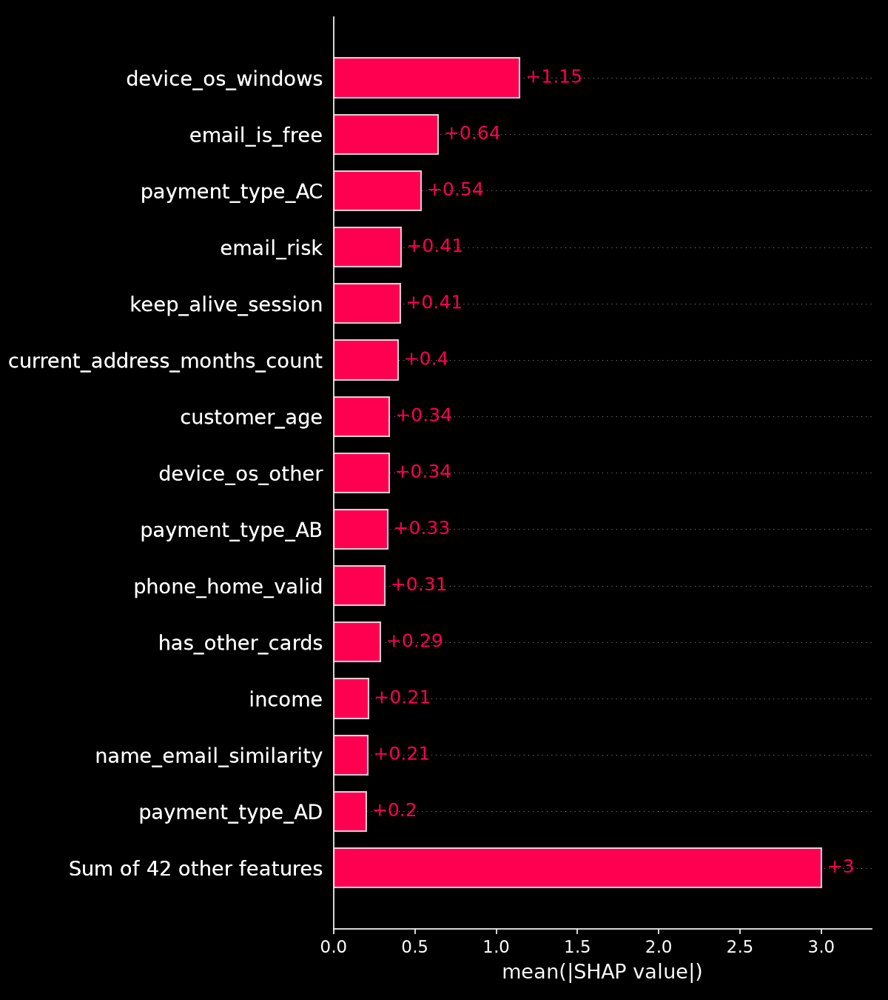
  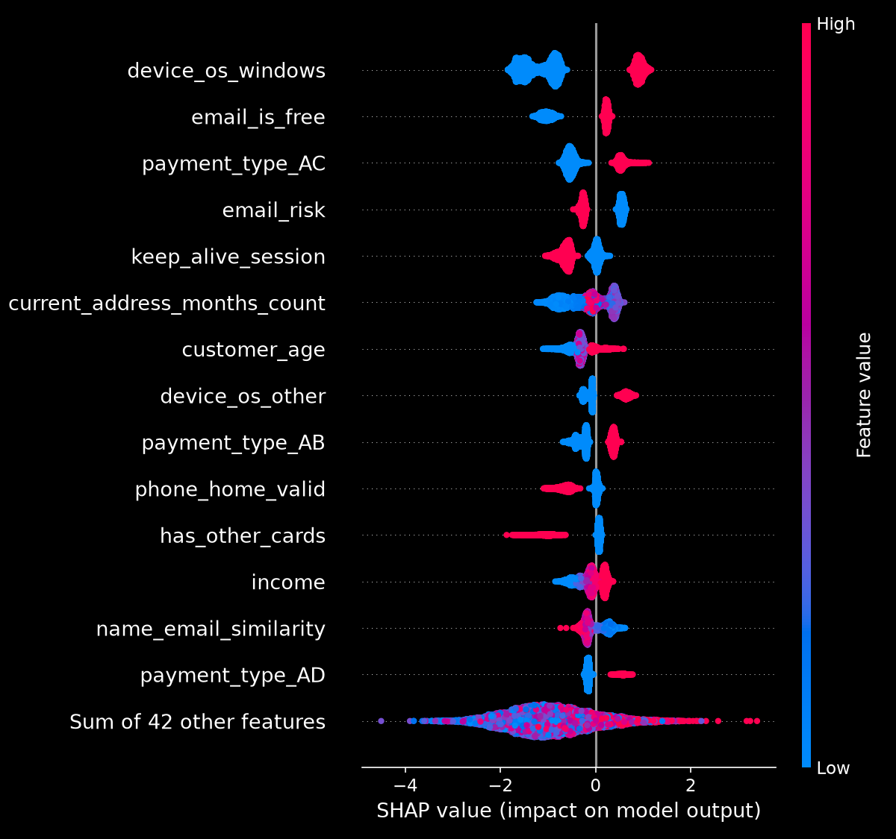
</p>
<p align="center"><em>Left: global feature importance (mean |SHAP value|). Right: SHAP beeswarm summary showing per-account value spread.</em></p>

Top SHAP-ranked features driving individual risk scores (`notebooks/04_risk_scoring_shap.ipynb`, computed on a 10,000-account sample from the held-out temporal test period):

- **`device_os_windows`** — the single strongest driver by a wide margin (mean |SHAP| = 1.145); a disproportionate share of fraudulent applications originate from Windows devices in this dataset.
- **`email_is_free`** — the second-strongest signal (0.643); free email providers are cheap to mass-create, consistent with the `email_risk` engineered feature.
- **`payment_type_AC`** — the specific payment type flagged as highest-fraud-rate in the EDA stage also ranks as a top individual SHAP driver (0.538).
- **`email_risk`**, **`keep_alive_session`**, **`current_address_months_count`**, **`customer_age`** — a cluster of identity-stability and session-behavior signals in the 0.34–0.41 range, reinforcing that short address tenure and anomalous session behavior are meaningful individual risk drivers, not just aggregate EDA patterns.

**Overall Observations:**
- Device and email signals dominate individual-account SHAP attributions even though they showed only weak standalone correlation with `fraud_bool` in the raw correlation heatmap — a good illustration of why tree-based models with proper explainability tooling outperform correlation-only analysis for this kind of tabular fraud problem.
- The compounded imbalance handling (SMOTE `sampling_strategy=0.1` plus `scale_pos_weight` on top) deliberately trades precision for recall across all four models — appropriate for a first-pass detector meant to route accounts into a downstream investigation, not to make final decisions.
- XGBoost's win margin over the AdaBoost runner-up (0.8892 vs. 0.8570 AUC-ROC) is meaningful but not enormous, which is why the system treats the model as a triage signal feeding a further investigation stage rather than a standalone verdict.

## Fraud Investigation Pipeline (Final System)

HIGH-risk accounts (fraud probability ≥ 0.75) don't stop at a risk score — they flow into a three-node LangGraph pipeline (`rag_agent/agents.py`) that investigates and then deterministically decides what happens to the account:

<p align="center">
  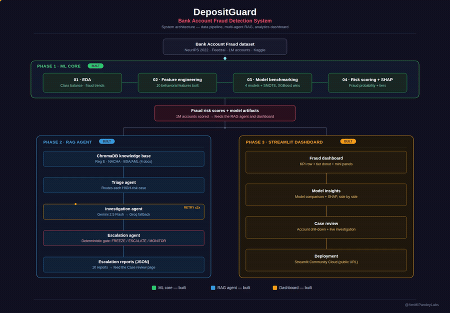
</p>

1. **Triage** — reads each account's precomputed fraud probability and SHAP profile from `scored_accounts.csv` and routes by fixed risk-tier thresholds: HIGH → Investigation, MEDIUM → flagged for manual review, LOW → auto-cleared. No LLM involved.
2. **Investigation** — retrieves relevant regulatory/fraud-typology text from a ChromaDB knowledge base (Reg E, NACHA return codes, BSA/AML overview, and fraud-type definitions, chunked and embedded from `rag_agent/fraud_kb/`), then asks an LLM to reason over the account's real top-5 SHAP features plus that retrieved context — **Google Gemini first, Groq (Llama 3.3 70B) as automatic fallback** on any Gemini failure. The LLM is constrained to return only `confidence`, `root_cause`, `regulatory_flags`, and a self-`critique`, each grounded explicitly in the SHAP features and retrieved text provided — it cannot invent a feature or cite a regulation not present in the retrieved context. If the returned confidence score falls below 0.80, the conditional edge routes back into Investigation for a second, broadened retrieval pass (capped at 2 passes total) before proceeding.
3. **Escalation** — applies a fixed, deterministic rule (`rag_agent/tools.py::make_escalation_decision`) over the account's risk tier, fraud probability, and any regulatory flags raised: HIGH risk with probability ≥ 0.90 → **FREEZE**; HIGH risk otherwise → **ESCALATE**; MEDIUM risk with regulatory flags → **ESCALATE**; MEDIUM with none → **MONITOR**; otherwise → **CLEAR**. This decision is never made by the LLM — it's a plain conditional over numbers and flags, which is what makes the final action auditable. The full report (investigation findings + rule-based decision + reasoning) is written to `rag_agent/outputs/escalation_reports/` as JSON and logged to a ChromaDB episodic-memory collection for future retrieval.

Risk tier breakdown across the full 1,000,000 scored accounts (`notebooks/04_risk_scoring_shap.ipynb`):

| Risk Tier | Threshold | Account Count | % of Population | Action Taken |
|---|---|---|---|---|
| HIGH | fraud probability ≥ 0.75 | 5,411 | 0.541% | Routed to Investigation → **FREEZE** (≥ 0.90) or **ESCALATE** |
| MEDIUM | 0.40 ≤ fraud probability < 0.75 | 29,449 | 2.945% | Flagged for manual review → **ESCALATE** (regulatory flags) or **MONITOR** |
| LOW | fraud probability < 0.40 | 965,140 | 96.514% | Auto-cleared → **CLEAR** |

Sample accounts from real generated escalation reports:

| Account | Fraud Probability | Risk Tier | Final Decision |
|---|---|---|---|
| 897616 | 0.9862 | HIGH | FREEZE |
| 812568 | 0.9303 | HIGH | FREEZE |
| 986601 | 0.8857 | HIGH | ESCALATE |

## Streamlit Dashboard
**Live app:** <a href="https://depositguard.streamlit.app/" target="_blank" rel="noopener noreferrer">depositguard.streamlit.app</a>

The full system is served as a three-page live dashboard:

- **Fraud dashboard** — portfolio-level metrics (accounts scored, predicted HIGH-risk rate, risk-tier breakdown), a risk-tier distribution donut, model comparison chart, fraud-probability distribution, and top-5 SHAP features / top-5 highest-risk accounts at a glance.

  <p align="center">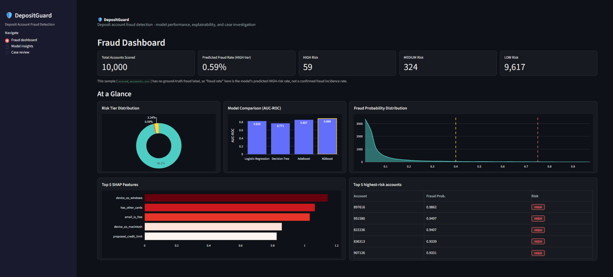</p>

- **Model insights** — the full 4-model comparison (AUC-ROC / Precision / Recall / F1 / FPR) with the winning model highlighted, the SHAP feature-importance chart, and a recomputed top-10 SHAP breakdown as a cross-check.

  <p align="center">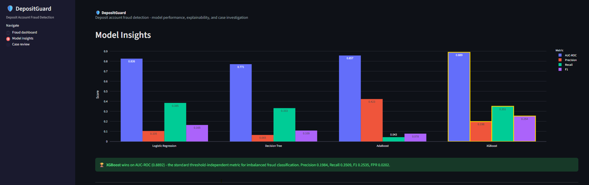</p>
  <p align="center">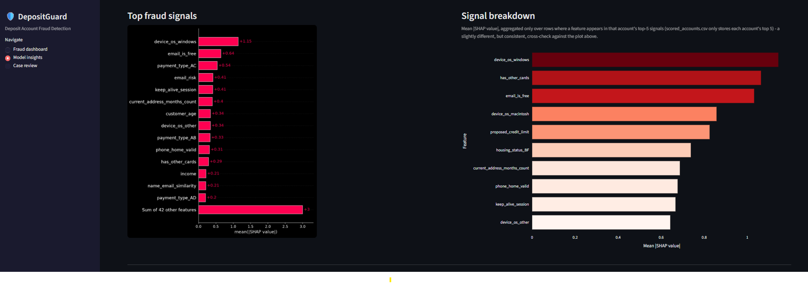</p>

- **Case review** — pick any HIGH-risk account to see its top-5 SHAP drivers, its full LangGraph escalation report (confidence, root cause, regulatory flags, analyst question, self-critique, final decision), and fraud-probability trends binned by feature.

  <p align="center">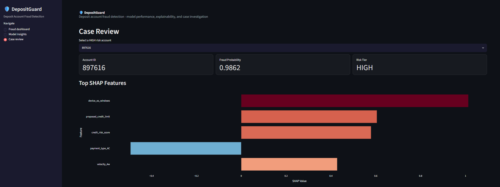</p>

**Live app:** <a href="https://depositguard.streamlit.app/" target="_blank" rel="noopener noreferrer">depositguard.streamlit.app</a>

## Conclusion

DepositGuard demonstrates that behavioral feature engineering plus SHAP-explained gradient boosting can meaningfully rank deposit-account fraud risk under realistic ~1:90 class imbalance (XGBoost AUC-ROC 0.8892 against a temporal, non-leaking validation split), and that a multi-agent LLM investigation layer can add regulatory-grounded reasoning on top of that score without sacrificing auditability — because the LLM investigates and explains, while a fixed rule set decides. The result is a system where every escalation outcome traces back to an inspectable condition on real model output, not an opaque LLM judgment call.

## Future Enhancements

- **Tableau leadership dashboard** — an executive-facing summary view is planned but not yet built; the `tableau/` directory is scaffolded for it.
- **Bias / threshold monitoring** — track whether risk-tier thresholds and escalation outcomes drift disparately across demographic or geographic segments over time.
- **Real-time API deployment** — wrap the scoring + investigation pipeline behind a low-latency API for point-of-application decisions instead of batch scoring.
- **Multi-account batch investigation** — extend `rag_agent/main.py` beyond its current sequential loop to concurrent/batched investigation of large HIGH-risk cohorts.

## Tools & Technologies Used

- **Python** — core language for data processing, modeling, and the agent pipeline.
- **XGBoost** — the winning gradient-boosted classifier powering the production risk scorer.
- **LangGraph** — orchestrates the Triage → Investigation → Escalation multi-agent state graph.
- **ChromaDB** — vector store for the regulatory-text knowledge base and episodic case memory.
- **Google Gemini API** — primary LLM for the Investigation agent's grounded reasoning.
- **Groq API** — automatic fallback LLM (Llama 3.3 70B) if Gemini is unavailable.
- **Streamlit** — serves the live three-page fraud analytics dashboard.
- **Plotly** — all interactive charts in the dashboard.
- **SHAP** — per-account and global feature-importance explainability for the XGBoost model.
- **imbalanced-learn (SMOTE)** — minority-class oversampling for training under class imbalance.

## How to Run This Project

1. Clone this repository:
   ```sh
   git clone https://github.com/AmitKPandeyLabs/DepositGuard.git
   ```
2. Navigate to the project directory:
   ```sh
   cd DepositGuard
   ```
3. Install the required dependencies:
   ```sh
   pip install -r requirements.txt
   ```
4. Run the notebooks in order:
   ```sh
   jupyter notebook notebooks/01_EDA.ipynb
   jupyter notebook notebooks/02_feature_engineering.ipynb
   jupyter notebook notebooks/03_model_benchmarking.ipynb
   jupyter notebook notebooks/04_risk_scoring_shap.ipynb
   ```
5. Set up a `.env` file in the project root with your API keys:
   ```env
   GEMINI_API_KEY=your_gemini_api_key
   GROQ_API_KEY=your_groq_api_key
   ```
6. Run the fraud investigation pipeline:
   ```sh
   python rag_agent/main.py
   ```
7. Launch the dashboard:
   ```sh
   streamlit run app.py
   ```

## License

This project is licensed under the MIT License - see the [LICENSE](LICENSE) file for details.
